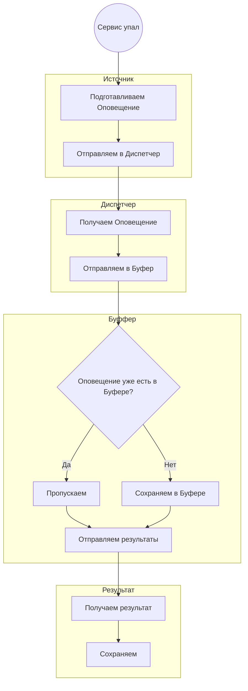

# Цикл работы принятия оповещений

```mermaid
flowchart

Старт@{ shape: circle, label: "Сервис упал" }

subgraph Источник
	direction TB
	ПодготовитьОповещение@{label: "Подготавливаем Оповещение"}
	ОтправитьВДиспетчер@{label: "Отправляем в Диспетчер"}
end

subgraph Диспетчер
	direction TB
	ПолучитьОповещение@{label: "Получаем Оповещение"}
	ОтправитьВБуфер@{label: "Отправляем в Буфер"}
end

subgraph Буффер
	direction TB
	ЕстьВБуфер@{shape: diamond, label: "Оповещение уже есть в Буфере?"}
	Пропускаем@{label: "Пропускаем"}
	СохранитьВБуфере@{label: "Сохраняем в Буфере"}
	ОтправитьРезультаты@{label: "Отправляем результаты"}
end

subgraph Результат
	direction LR
	ПолучитьРезультат@{label: "Получаем результат"}
	СохранитьРезультат@{label: "Сохраняем"}
end

Старт --> ПодготовитьОповещение
ПодготовитьОповещение --> ОтправитьВДиспетчер
ОтправитьВДиспетчер --> ПолучитьОповещение
ПолучитьОповещение --> ОтправитьВБуфер
ОтправитьВБуфер --> ЕстьВБуфер
ЕстьВБуфер -->|Да| Пропускаем
ЕстьВБуфер -->|Нет| СохранитьВБуфере
Пропускаем --> ОтправитьРезультаты
СохранитьВБуфере --> ОтправитьРезультаты
ОтправитьРезультаты --> ПолучитьРезультат
ПолучитьРезультат --> СохранитьРезультат
```
