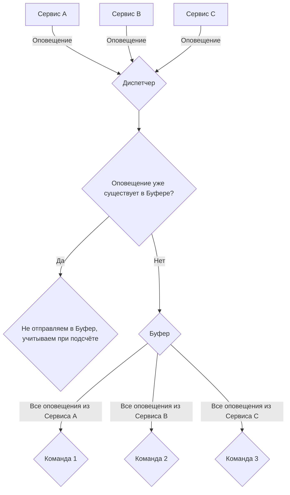

# Описание
## Название
Система оповещения о сбоях командам оперирования.
## Краткое описание
Представим себе компанию N, у которой есть множество различных сервисов всех сортов и расцветок - от мелких монолитов до крупных сетей микросервисов. Так как рано или поздно любой сервис в продакшане может начать сбоить по тем или иным причинам, компания N имеет специальные команды оперирования, задачей которых является быстрое реагирование на инциндент, восстановление работы сервиса и определение причин происшествия. С этой задачей командам может помочь специальная система оповещения.
## Словарь
Добавить описание, что такое диспетчер, буффер, команда, результат
# Элементы
## Источники (ИБ, ИЗ1)
Источниками являются агенты, каждый из которых в фоновом режиме собирает информацию о состояние сервиса.
В случае сбоя, агенты собирают как можно больше информации о системе и сервисе в частности и отправляют собранные данные на обработку.  

Ожидается распределение по Пуассону.
## Законы распределения времени обслуживания (П32)
Каждый сбой является важным для рассмотрения, поэтому каждой заявке стоит уделить равное количество времени.
## Дисциплина буферизации (Д1О32)
Так как сбои появляются в течение дня, все оповещения о них сохраняются в буфере в порядке поступления.
## Дисциплина отказа (Д1ОО5)
Чтобы не повторят одни и те же оповещения от тех же источников, система не будет их дублировать, но будет учитывать при подсчёте общего количества сбоев в системе.
## Дисциплина выбора обслуживающего прибора (Д2П1)
Система будет последовательно выбирать команды, начиная с наиболее приоритетных. 
## Дисциплина выбора заявки на обслуживание (Д2Б5)
Все оповещения в буфере от одной системе будут передаваться выбранной команде.

Это позволит команде полностью сконцентрировать своё внимание на восстановление работы одного сервиса, не отвлекаясь на другие.
## Отображение результатов (ОР1, ОД3)
В качестве результатов во время работы сервиса будут отображаться в виде временных диаграм. При сборе статистики результат будет возвращаться в качестве сводной таблицы.

Это позволяет командам собирать статистику, в какой час дня происходит наибольшее количество сбоев, что может помочь, например, для более тонкой настройки балансировщиков нагрузки.
# График

