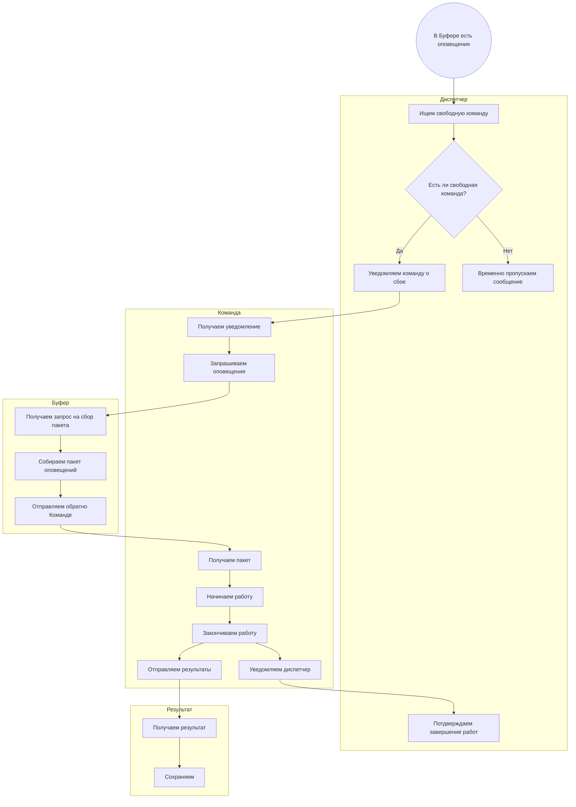

# Цикл работы обработки оповещений

```mermaid
flowchart

Старт@{ shape: circle, label: "В Буфере есть оповещения" }

subgraph Диспетчер
	ПоискКоманды@{label: "Ищем свободную команду" }
	ЕстьСвободная@{shape: diamond, label: "Есть ли свободная команда?"}
	УведомитьКоманду@{label: "Уведомляем команду о сбое"}
	Пропускаем@{label: "Временно пропускаем сообщение"}
	ПотдвердитьЗавершение@{label: "Потдверждаем завершение работ"}
end

subgraph Команда
	ПолучитьУведомление@{label: "Получаем уведомление"}
	ЗапросОповещений@{label: "Запрашиваем оповещения"}
	ПолучитьПакет@{label: "Получаем пакет"}
	НачатьРаботу@{label: "Начинаем работу"}
	ЗакончитьРаботу@{label: "Закончиваем работу"}
	ОтправитьРезультаты@{label: "Отправляем результаты"}
	УведомитьДиспетчер@{label: "Уведомляем диспетчер"}
end

subgraph Буфер
	ПолучитьЗапрос@{label: "Получаем запрос на сбор пакета"}
	СобратьПакет@{label: "Собираем пакет оповещений"}
	ОтправитьПакет@{label: "Отправляем обратно Команде"}
end

subgraph Результат
	ПолучитьРезультаты@{label: "Получаем результат"}
	СохранитьРезультаты@{label: "Сохраняем"}
end

Старт --> ПоискКоманды

ПоискКоманды --> ЕстьСвободная
ЕстьСвободная -->|Нет| Пропускаем
ЕстьСвободная -->|Да| УведомитьКоманду
УведомитьКоманду --> ПолучитьУведомление

ПолучитьУведомление --> ЗапросОповещений
ЗапросОповещений --> ПолучитьЗапрос

ПолучитьЗапрос --> СобратьПакет
СобратьПакет --> ОтправитьПакет
ОтправитьПакет --> ПолучитьПакет

ПолучитьПакет --> НачатьРаботу
НачатьРаботу --> ЗакончитьРаботу
ЗакончитьРаботу --> ОтправитьРезультаты
ЗакончитьРаботу --> УведомитьДиспетчер

ОтправитьРезультаты --> ПолучитьРезультаты
ПолучитьРезультаты --> СохранитьРезультаты

УведомитьДиспетчер --> ПотдвердитьЗавершение
```
