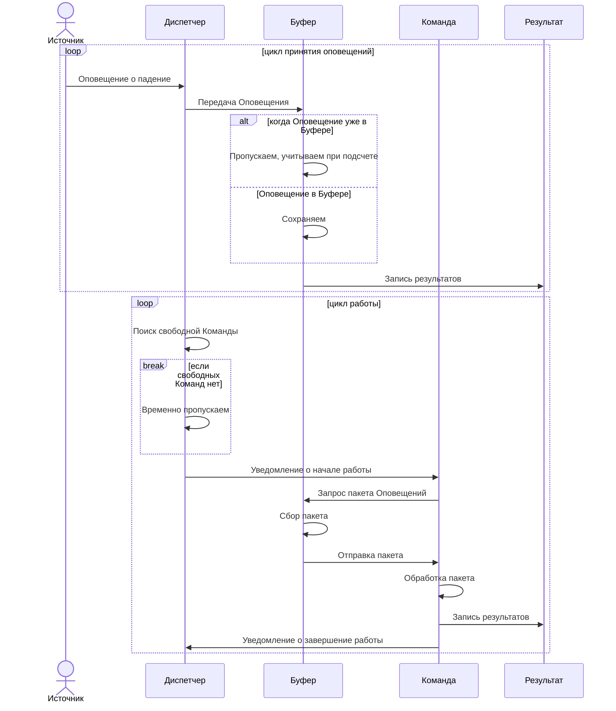

# Примерный ход работы сервиса

```mermaid
sequenceDiagram

actor Источник
participant Диспетчер
participant Буфер
participant Команда
participant Результат

loop цикл принятия оповещений
	Источник ->> Диспетчер: Оповещение о падение
	
	Диспетчер ->> Буфер: Передача Оповещения
	alt когда Оповещение уже в Буфере
		Буфер ->> Буфер: Пропускаем, учитываем при подсчете
	else Оповещение в Буфере
		Буфер ->> Буфер: Сохраняем
	end
	
	Буфер ->> Результат: Запись результатов
end

loop цикл работы
	Диспетчер ->> Диспетчер: Поиск свободной Команды
	break если свободных Команд нет
		Диспетчер ->> Диспетчер: Временно пропускаем
	end
	Диспетчер ->> Команда: Уведомление о начале работы
	
	Команда ->> Буфер: Запрос пакета Оповещений
	Буфер ->> Буфер: Сбор пакета
	Буфер ->> Команда: Отправка пакета
	
	Команда ->> Команда: Обработка пакета
	Команда ->> Результат: Запись результатов
	Команда ->> Диспетчер: Уведомление о завершение работы
end
```
